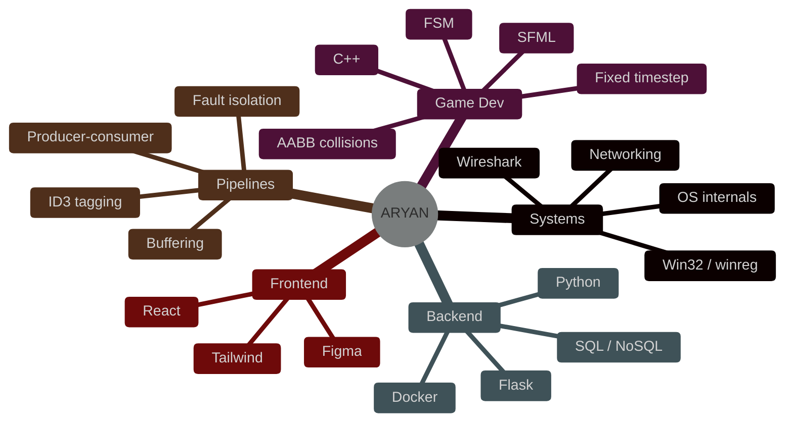
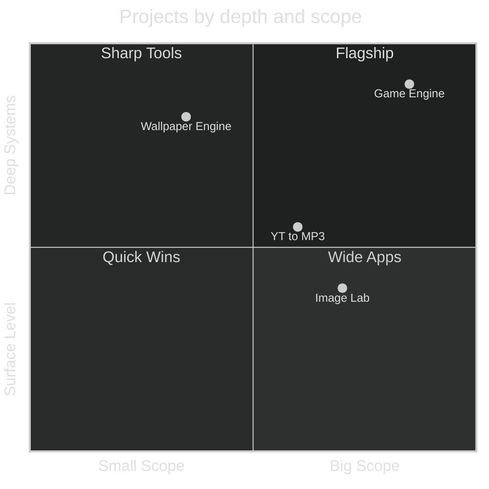
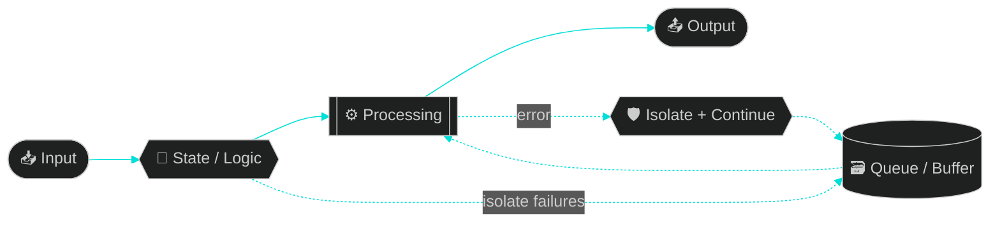
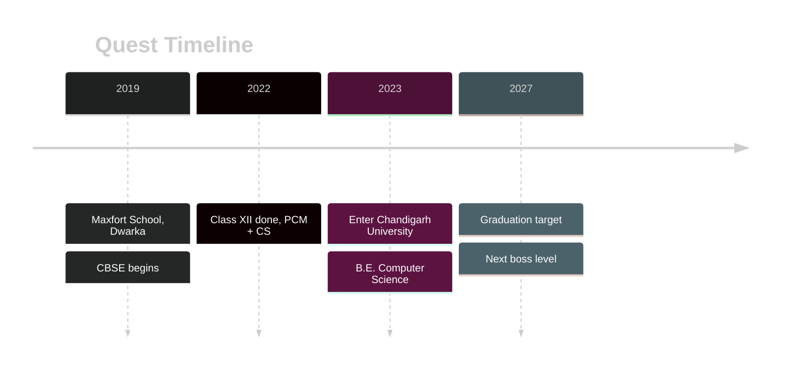

<div align="center">


<a href="https://imapcode.vercel.app">
  
</a>

<br/>


<br/><br/>

<a href="https://imapcode.vercel.app"></a>
<a href="https://linkedin.com/in/imapcode"></a>
<a href="mailto:student.aryanmishra@gmail.com"></a>


<br/>


</div>


<h2 align="center">📟 &nbsp;<code>BOOT SEQUENCE</code></h2>

```text
[  0.000000] Linux aryan 6.9.0-imapcode #1 SMP PREEMPT_DYNAMIC
[  0.000420] BIOS-e820: [mem 0x0000000000000000] usable: curiosity
[  0.013370] CPU0: Intel(R) Brain(TM) @ 3.2GHz  (threads: too many)
[  0.042000] Calibrating delay loop... 9001.00 BogoMIPS
[  0.101010] mounting /dev/coffee ........................ [  OK  ]
[  0.202020] starting decoupled-architecture.service ..... [  OK  ]
[  0.303030] starting deterministic-state.service ........ [  OK  ]
[  0.404040] starting fail-in-isolation.service .......... [  OK  ]
[  0.505050] starting sleep.service ...................... [FAILED]
[  0.606060] Reached target: BUILDING_COOL_STUFF
aryan login: _
```


<h2 align="center">🖥️ &nbsp;<code>~/aryan $ neofetch</code></h2>

```text
   ▄▄▄▄▄▄▄▄▄▄▄▄▄▄▄            aryan@imapcode
  ██  ▄▄▄▄▄▄▄▄▄▄  ██          ───────────────────────────────
  ██  ██ ▀▀▀▀ ██  ██          🎓 Edu      B.E. CSE · Chandigarh University '27
  ██  ██  ▄▄  ██  ██          📍 Loc      Delhi, India
  ██  ██ ▀▀▀▀ ██  ██          🧠 Focus    OS internals · game engines · I/O pipelines
  ██  ▀▀▀▀▀▀▀▀▀▀  ██          ⚙️  Langs    C++ · C · Python · Java · JS · Bash
  ▀▀▀▀▀▀▀▀▀▀▀▀▀▀▀▀▀           🎨 Vibe     decoupled · deterministic · fast
                              🔥 Status   building things that go brrr
                              ██████ ██████ ██████ ██████ ██████ ██████
```


<h2 align="center">🎮 &nbsp;PLAYER CARD</h2>

<div align="center">

| 🧙 CLASS | ⚔️ MAIN WEAPON | 🛡️ OFF-HAND | 🗺️ ZONE | 🏆 QUEST |
|:---:|:---:|:---:|:---:|:---:|
| **Systems Hacker** | `C++` | `Python` | `Delhi, IN` | *Ship it. Fast.* |


<sub><i>Stat bars are vibes, not benchmarks. 😄</i></sub>

</div>


<h2 align="center">⚡ &nbsp;POWER STACK</h2>

<div align="center">


<br/>

<br/>

<br/>

<br/><br/>


</div>

<details>
<summary><b>🧠 &nbsp;Expand the skill mindmap</b></summary>



</details>


<h2 align="center">🚀 &nbsp;THE BUILD LOG</h2>

<table>
<tr>
<td width="50%" valign="top">

<p align="center"></p>

**Component-based engine, fixed-timestep loop.**
Input, physics and rendering are three separate subsystems. A finite state machine drives the character (idle → moving → shooting), so game logic never touches the renderer.

`C++` `SFML` `AABB` `FSM`

**⚡ Custom AABB collisions · Stable fixed-step updates**

<p align="center"><a href="https://github.com/imapcode/2d-game-engine"></a></p>

</td>
<td width="50%" valign="top">

<p align="center"></p>

**A modular image pipeline with a Tkinter UI.**
I/O, processing and rendering are split into layers. In-memory buffering kills redundant disk reads between chained ops.

`Python` `OpenCV` `Pillow` `Tkinter`

**⚡ Batch compress · convert · resize · colorize**

<p align="center"><a href="https://github.com/imapcode/image-file-manipulation"></a></p>

</td>
</tr>
<tr>
<td width="50%" valign="top">

<p align="center"></p>

**Talks straight to Windows.**
Registry access through `winreg` and `ctypes` sets wallpapers at the OS level, with an O(1) keyboard-driven directory index on top.

`Python` `winreg` `ctypes` `Win32 API`

**⚡ Registry hooks · O(1) navigation**

<p align="center"><a href="https://github.com/imapcode/wallpaper-engine"></a></p>

</td>
<td width="50%" valign="top">

<p align="center"></p>

**Producer-consumer download queue.**
Download scheduling is split from tagging, and one bad network call or tag never kills the batch. An Excel sheet drives cover art, lyrics and ID3 tags.

`yt-dlp` `pandas` `eyed3` `mutagen`

**⚡ Per-item fault isolation · zero manual tagging**

<p align="center"><a href="https://github.com/imapcode/yt-downloader-metadata-embedder"></a></p>

</td>
</tr>
</table>

<details>
<summary><b>🔬 &nbsp;Peek under the hood: the game loop</b></summary>

```cpp
// fixed timestep: deterministic physics, decoupled from render rate
const float dt = 1.0f / 60.0f;
float accumulator = 0.0f;

while (window.isOpen()) {
    accumulator += clock.restart().asSeconds();

    input.poll(window);                 // subsystem 1: input

    while (accumulator >= dt) {
        physics.step(dt);               // subsystem 2: physics (AABB)
        fsm.update(dt);                 // idle -> moving -> shooting
        accumulator -= dt;
    }

    renderer.draw(window);              // subsystem 3: render never touches logic
}
```

</details>

<details>
<summary><b>🗺️ &nbsp;Project map: effort vs. systems-depth</b></summary>



</details>


<h2 align="center">🧬 &nbsp;HOW I THINK</h2>



<div align="center">


</div>


<h2 align="center">🐍 &nbsp;CONTRIBUTION SNAKE</h2>

<div align="center">

<picture>
  <source media="(prefers-color-scheme: dark)" srcset="https://raw.githubusercontent.com/imapcode/imapcode/output/github-contribution-grid-snake-dark.svg" />
  <source media="(prefers-color-scheme: light)" srcset="https://raw.githubusercontent.com/imapcode/imapcode/output/github-contribution-grid-snake.svg" />
  
</picture>

<sub><i>(needs the tiny workflow file, see <code>snake.yml</code>)</i></sub>

</div>


<h2 align="center">📊 &nbsp;LIVE TELEMETRY</h2>

<div align="center">


</div>


<h2 align="center">🎓 &nbsp;LEVEL HISTORY</h2>

<table align="center">
<tr>
<td align="center" width="50%">

**🏛️ Chandigarh University**
<br/>`2023 → 2027`
<br/>B.E. Computer Science
<br/>
<br/><sub>DSA · OS · DBMS · Networks · OOP · Comp. Org</sub>

</td>
<td align="center" width="50%">

**🏫 Maxfort School, Dwarka**
<br/>`2019 → 2022`
<br/>CBSE · PCM + CS
<br/> 
<br/><sub>Physics · Chemistry · Maths · CS</sub>

</td>
</tr>
</table>




<h2 align="center">🕹️ &nbsp;ACHIEVEMENTS UNLOCKED</h2>

<div align="center">

| 🏅 | Achievement | Status |
|:---:|---|:---:|
| 🎮 | Built a game engine with a fixed-timestep loop | ✅ |
| 🪟 | Set wallpapers through the Windows registry | ✅ |
| 🎧 | Automated ID3 tagging with zero manual work | ✅ |
| 🖼️ | Shipped a batch image pipeline with in-memory buffering | ✅ |
| 🦈 | Read packets in Wireshark for fun | ✅ |
| 🚀 | Land a systems / backend / game-engine internship | 🔓 *in progress* |

</div>


<div align="center">

<h2>🤝 &nbsp;LET'S COLLAB</h2>

**Open to internships & projects in systems, backend and game-engine land.**

```text
┌──────────────────────────────────────────────┐
│  $ ./contact --to aryan --priority urgent    │
│  > connecting ................. [ OK ]       │
│  > let's build something fast.               │
└──────────────────────────────────────────────┘
```

<a href="mailto:student.aryanmishra@gmail.com"></a>
<a href="https://imapcode.vercel.app"></a>
<a href="https://linkedin.com/in/imapcode"></a>

<br/><br/>

<sub>`while (alive) { learn(); build(); ship(); }`</sub>

</div>


