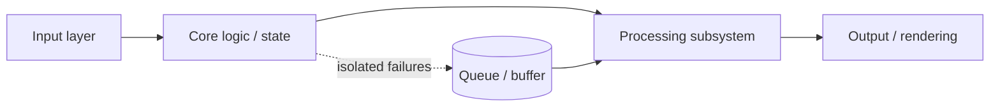

<!-- ═══════════════ HERO ═══════════════ -->

 

 

<!-- ═══════════════ ABOUT ═══════════════ -->
## `01` &nbsp;About

> I like knowing what's underneath the abstraction: from OS registry hooks to hardware-level collision logic.

I'm a third-to-final-year B.E. Computer Science student who builds systems software, game-engine internals and backend pipelines. My default design instincts are **decoupled subsystems**, **memory-efficient data flow** and **deterministic state**.

<table>
<tr>
<td width="50%" valign="top">

**Now**
- 🔧 Building system utilities, low-level OS tools and modular game architectures

**Studying**
- 📚 DSA · Operating Systems · Computer Networks · DBMS

</td>
<td width="50%" valign="top">

**Focus areas**
- ⚙️ Systems programming & OS architecture
- 🎮 Component-based game loops & physics
- 📦 High-throughput I/O & media pipelines
- 🗄️ Backend microservices & relational DBs

</td>
</tr>
</table>

 

<!-- ═══════════════ STACK ═══════════════ -->
## `02` &nbsp;Toolbox

<table>
<tr>
  <td><b>Languages</b></td>
  <td></td>
</tr>
<tr>
  <td><b>Web</b></td>
  <td></td>
</tr>
<tr>
  <td><b>Data</b></td>
  <td></td>
</tr>
<tr>
  <td><b>Infra</b></td>
  <td></td>
</tr>
<tr>
  <td><b>Analysis & Design</b></td>
  <td> &nbsp;</td>
</tr>
</table>

 

<!-- ═══════════════ PROJECTS ═══════════════ -->
## `03` &nbsp;Selected Projects

<table>
<tr>
<td width="50%" valign="top">

### 🎮 [2D Game Engine](https://github.com/imapcode/2d-game-engine)
`C++` `SFML` `AABB` `FSM`

Component-based engine on a fixed-timestep loop. Input, physics and rendering live in separate subsystems; character behaviour (idle / moving / shooting) runs on a finite state machine, so game logic never touches rendering.

**Highlights:** custom AABB collision · fixed-timestep updates · FSM-driven states

</td>
<td width="50%" valign="top">

### 🖼️ [Image File Manipulation System](https://github.com/imapcode/image-file-manipulation)
`Python` `OpenCV` `Pillow` `Tkinter`

Modular pipeline splitting I/O, processing and rendering. In-memory buffering removes redundant disk reads between chained operations, and the event-driven Tkinter UI stays decoupled from the core.

**Highlights:** batch compression · format conversion · resize · grayscale colorization

</td>
</tr>
<tr>
<td width="50%" valign="top">

### 🖥️ [Wallpaper Engine](https://github.com/imapcode/wallpaper-engine)
`Python` `winreg` `ctypes` `Windows API`

Talks to the OS directly through the registry and Win32 calls to set wallpapers. A directory-indexing layer gives O(1) keyboard navigation, with input handling separated from wallpaper state.

**Highlights:** registry interface · O(1) navigation · decoupled input layer

</td>
<td width="50%" valign="top">

### 🎵 [YouTube Downloader & Metadata Embedder](https://github.com/imapcode/yt-downloader-metadata-embedder)
`yt-dlp` `pandas` `eyed3` `mutagen`

Producer-consumer queue that separates download scheduling from tagging. Failures are isolated per item, and an Excel-driven pipeline embeds cover art, lyrics and ID3 tags automatically.

**Highlights:** fault isolation · Excel-driven metadata · auto ID3 tagging

</td>
</tr>
</table>

<b>🧩 Architecture patterns across these projects</b>

 

Every project follows the same idea: keep input, logic and output in separate layers so each can change, fail or scale independently.

 

<!-- ═══════════════ EDUCATION ═══════════════ -->
## `04` &nbsp;Education

| Period | Institution | Program | Result |
| :-- | :-- | :-- | :-- |
| **2023 – 2027** | Chandigarh University | B.E. Computer Science | CGPA **7.5** |
| **2019 – 2022** | Maxfort School, Dwarka, New Delhi | CBSE · PCM with CS | **84%** (XII) · **80%** (X) |

Coursework: Data Structures & Algorithms · Operating Systems · DBMS · Computer Networks · OOP · Computer Organization

 

<!-- ═══════════════ STATS ═══════════════ -->
## `05` &nbsp;Activity

 

<!-- ═══════════════ CONTACT ═══════════════ -->
## `06` &nbsp;Let's talk

Open to internships and collaborations in **systems, backend and game-engine work**.
Reach me at [student.aryanmishra@gmail.com](mailto:student.aryanmishra@gmail.com) or through my [portfolio](https://imapcode.vercel.app).

