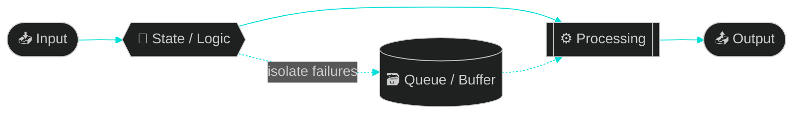

<div align="center">


<a href="https://imapcode.vercel.app">
  
</a>

<br/><br/>

<a href="https://imapcode.vercel.app"></a>
<a href="https://linkedin.com/in/imapcode"></a>
<a href="mailto:student.aryanmishra@gmail.com"></a>


<br/>


</div>


<h2 align="center">🖥️ &nbsp;<code>~/aryan $ neofetch</code></h2>

```text
   ▄▄▄▄▄▄▄▄▄▄▄▄▄▄▄            aryan@imapcode
  ██  ▄▄▄▄▄▄▄▄▄▄  ██          ───────────────────────────────
  ██  ██ ▀▀▀▀ ██  ██          🎓 Edu      B.E. CSE · Chandigarh University '27
  ██  ██  ▄▄  ██  ██          📍 Loc      Delhi, India
  ██  ██ ▀▀▀▀ ██  ██          🧠 Focus    OS internals · game engines · I/O pipelines
  ██  ▀▀▀▀▀▀▀▀▀▀  ██          ⚙️  Langs    C++ · C · Python · Java · JS · Bash
  ▀▀▀▀▀▀▀▀▀▀▀▀▀▀▀▀▀           🎨 Vibe     decoupled · deterministic · fast
                              🔥 Status   building things that go brrr
```


<h2 align="center">⚡ &nbsp;POWER STACK</h2>

<div align="center">


<br/>

<br/>

<br/>

<br/><br/>


</div>


<h2 align="center">🚀 &nbsp;THE BUILD LOG</h2>

<table>
<tr>
<td width="50%" valign="top">

<p align="center"></p>

**Component-based engine, fixed-timestep loop.**
Input, physics and rendering are three separate subsystems. A finite state machine drives the character (idle → moving → shooting), so game logic never touches the renderer.

`C++` `SFML` `AABB` `FSM`

**⚡ Custom AABB collisions · Stable fixed-step updates**

<p align="center"><a href="https://github.com/imapcode/2d-game-engine"></a></p>

</td>
<td width="50%" valign="top">

<p align="center"></p>

**A modular image pipeline with a Tkinter UI.**
I/O, processing and rendering are split into layers. In-memory buffering kills redundant disk reads between chained ops.

`Python` `OpenCV` `Pillow` `Tkinter`

**⚡ Batch compress · convert · resize · colorize**

<p align="center"><a href="https://github.com/imapcode/image-file-manipulation"></a></p>

</td>
</tr>
<tr>
<td width="50%" valign="top">

<p align="center"></p>

**Talks straight to Windows.**
Registry access through `winreg` and `ctypes` sets wallpapers at the OS level, with an O(1) keyboard-driven directory index on top.

`Python` `winreg` `ctypes` `Win32 API`

**⚡ Registry hooks · O(1) navigation**

<p align="center"><a href="https://github.com/imapcode/wallpaper-engine"></a></p>

</td>
<td width="50%" valign="top">

<p align="center"></p>

**Producer-consumer download queue.**
Download scheduling is split from tagging, and one bad network call or tag never kills the batch. An Excel sheet drives cover art, lyrics and ID3 tags.

`yt-dlp` `pandas` `eyed3` `mutagen`

**⚡ Per-item fault isolation · zero manual tagging**

<p align="center"><a href="https://github.com/imapcode/yt-downloader-metadata-embedder"></a></p>

</td>
</tr>
</table>


<h2 align="center">🧬 &nbsp;HOW I THINK</h2>



<div align="center">

**Decouple everything · Buffer smartly · Fail in isolation · Keep state deterministic**

</div>


<h2 align="center">📊 &nbsp;LIVE TELEMETRY</h2>

<div align="center">


</div>


<h2 align="center">🎓 &nbsp;LEVEL HISTORY</h2>

<table align="center">
<tr>
<td align="center" width="50%">

**🏛️ Chandigarh University**
<br/>`2023 → 2027`
<br/>B.E. Computer Science
<br/>
<br/><sub>DSA · OS · DBMS · Networks · OOP · Comp. Org</sub>

</td>
<td align="center" width="50%">

**🏫 Maxfort School, Dwarka**
<br/>`2019 → 2022`
<br/>CBSE · PCM + CS
<br/> 
<br/><sub>Physics · Chemistry · Maths · CS</sub>

</td>
</tr>
</table>

<div align="center">

<h2>🤝 &nbsp;LET'S COLLAB</h2>

**Open to internships & projects in systems, backend and game-engine land.**

<a href="mailto:student.aryanmishra@gmail.com"></a>
<a href="https://imapcode.vercel.app"></a>

</div>


